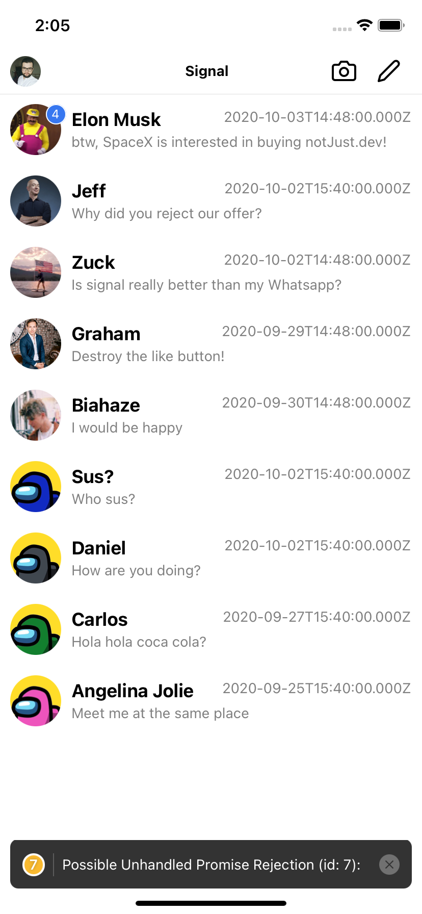

# WeChater
A React Native and AWS Amplify Based Mobile Realtime Chat App 

Steps: 
1. git clone -b ui https://github.com/LockyWen/WeChater.git
2. npm install
3. Create your aws account and set up amplify
4. amplify config 
5. amplify push 

Pages: 

Sign Up Page: Fill you username(email), password, email, phone number and click sign up buttom. Then you will receive the verification code through email

Press the profile logo to signout, press chat room item to sign in 

Chat with your friends 

